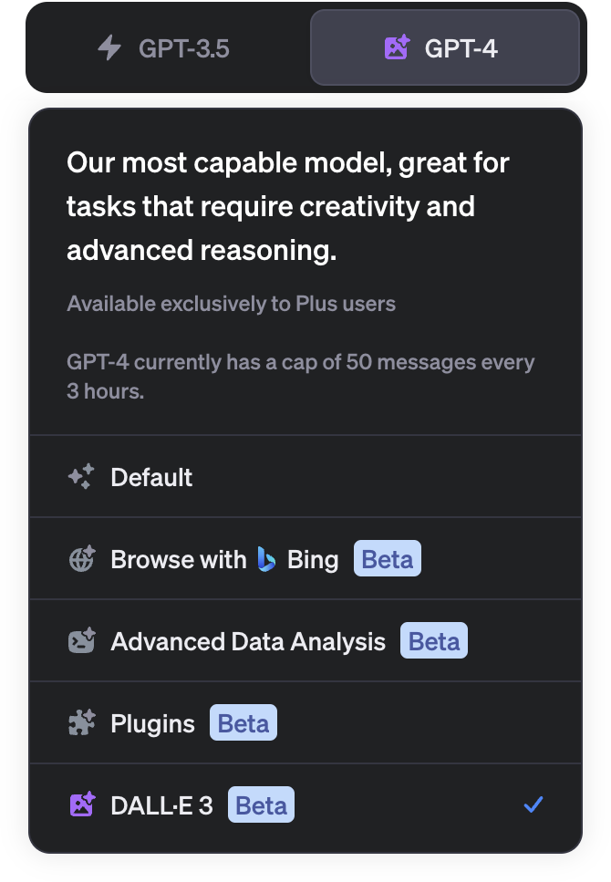
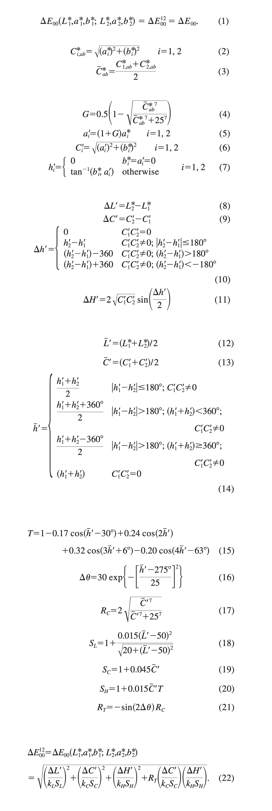

```fm
style: negative
background: true
```

## Hello _👋_

# {{process.content.frontmatter.title}}

_News of the last 6 months_

<footer>

2023 · Zurich · Stefan Huber

</footer>

--s--

```fm
style: image
background:
  image: https://portrait.signalwerk.ch/illustration/2020/rgb/w4000/stefan-huber.jpg
  position: 50% 40%
```

## Stefan

<div class="box box--w40p box--bottom box--white box--padding small">

- Developer
- ❦ Typography

</div>

<footer class="footer--right">

Illustration by [Benjamin Güdel](http://www.guedel.biz/) · 2020

</footer>

--s--

```fm
style: negative
background: true
```

## Welcome

# _Liip Lab_ · AI

- **[liip.to/ailab](https://liip.to/ailab)**
- **Google-Calendar «Events intern»**

--s--

```fm
style: negative
background: true
```

## Large Language Models

# What's _new_?

<!--

- New functionalities with ChatGPT
- Llama 2
- LLM everywhere

-->

--s--

## ChatGPT



--s--

## Browse with Bing

- Included in ChatGPT Plus
- Browse _live data_ from the **Internet**
- No more [URL requests](https://chat.openai.com/share/0db27307-e6e2-4437-960d-cc222b04de25) like [before](https://chat.openai.com/share/de4f1d14-cf3b-4a48-a181-d56e7d355308)
- Browse with Bing was temporarily disabled
- [Browse with Bing](https://chat.openai.com/share/dbd70f04-9fc1-4cd4-9118-0a7347ba1429) works again for URLs
- [Browse with Bing](https://chat.openai.com/share/7bf31397-17fc-4022-92bf-61729eb95e69) works again for general requests
- slow & errors …

<footer>

Source: [OpenAI: Web Browsing in ChatGPT is disabled since July 3, 2023](https://help.openai.com/en/articles/8077698-how-do-i-use-chatgpt-browse-with-bing-to-search-the-web)

</footer>

--s--

## DALL·E 3

- Generate Image from Text
- Included in ChatGPT Plus (?)
- `1024 px` × `1024 px`
- slow …
- Still not [Midjourney](https://www.midjourney.com/)

--s--

## DALL·E 3 · prompt

<style>

.code--wrap code {
  white-space: normal;
}

</style>

<div class="grid">
<div class="col6 img--w100p">


</div>
<div class="col4 small code--wrap">

> `Give me an image where you see Hackers attending a virtual AI-Course. In the style of a cool hacker comic.`

</div>
</div>

<footer>

Source: [ChatGPT 23. 9. 2023 · private Link](https://chat.openai.com/c/2e5e8a0f-c036-4c5c-891c-231b83d06255)

</footer>

--s--

## DALL·E 3 · refinement

<style>

.code--wrap code {
  white-space: normal;
}

</style>

<div class="grid">
<div class="col6 img--w100p">


</div>
<div class="col4 small code--wrap">

> `please do it in only 3 colors and a flat style`

</div>
</div>

<footer>

Source: [ChatGPT 23. 9. 2023 · private Link](https://chat.openai.com/c/2e5e8a0f-c036-4c5c-891c-231b83d06255)

</footer>

--s--

```fm
style: negative
background: true
```

## ChatGPT

# _👁️_ vision _👁️_

--s--

## vision

- Included in ChatGPT Plus
- Requests _based on pictures_ in ChatGPT Plus
- slow & errors …

--s--

## Example for vision



<footer>

Source: [ChatGPT 23. 9. 2023 · private Link](https://chat.openai.com/c/0ff4bd58-78ee-49f8-9e08-498687d01e64) · [CIEDE2000 Paper](https://hajim.rochester.edu/ece/sites/gsharma/ciede2000/ciede2000noteCRNA.pdf)

</footer>

--s--

## Example for vision

- Took me 2 – 3 tries to request the right code
- JavaScript Code works
- Unittest: **24 of 34 Tests** work

--s--

## Advance Data Analysis

- Included in ChatGPT Plus
- Can _«do stuff»_ with **images/csv/pdf/…**
- [Example](https://chat.openai.com/c/df8e02c4-3748-40a2-aaf6-6712ce558ac2) to plot Data (private Link)
- [Example](https://chat.openai.com/c/940df144-c1ef-4803-805f-2fea33ea101e) to write test (private Link)

--s--

## Example for Advance Data Analysis

- Took me 1 to request the right code
- JavaScript Code works
- All **34 unit-tests** work
- Took me endless hours to write original code

<footer>

Source: [ChatGPT 23. 9. 2023 · private Link](https://chat.openai.com/c/9d7f1454-8600-4ef6-b2a7-f062a8f54158) · [CIEDE2000 Paper](https://hajim.rochester.edu/ece/sites/gsharma/ciede2000/ciede2000noteCRNA.pdf)

</footer>

--s--

## ChatGPT This & that

- Cutoff date January 2022 (before September 2021)
- Shortcuts (see `CMD + /`)
- Consecutive output when asking about Code (feeling)
- Custom instructions

--s--

```fm
style: negative
background: true
```

## There is more

# Other _Large Language Models_

--s--

## Llama 2

- Can be hosted locally
- OK answers
- Not so good with multilingual prompts

--s--

## Microsoft Azure

- [Same API](https://azure.microsoft.com/en-us/products/cognitive-services/openai-service/) as OpenAI
- _Models from OpenAI_ hosted by Microsoft
- Almost the [same pricing](https://azure.microsoft.com/en-us/pricing/details/cognitive-services/openai-service/) as OpenAI
- Offers [**EU/Swiss hosting**](https://azure.microsoft.com/en-us/explore/global-infrastructure/products-by-region/?products=cognitive-services&regions=switzerland-north,switzerland-west,europe-north,europe-west)
- Many [ISO-Certificates](https://learn.microsoft.com/en-us/azure/compliance/offerings/offering-iso-27001)

--s--

## LLM's concepts everywhere

- Weird/complex [example](https://github.com/Srijith-rkr/Whispering-LLaMA) of LLM mix
- Keyboard autocomplete in iOS
- (Google) Search

--s--

```fm
style: negative
background: true
```

## exit 0; thx

# Questions?

--s--

```fm
style: negative
background: true
```

## Reminder

# _Liip Lab_ · AI

- **[liip.to/ailab](https://liip.to/ailab)**
- **Google-Calendar «Events intern»**
